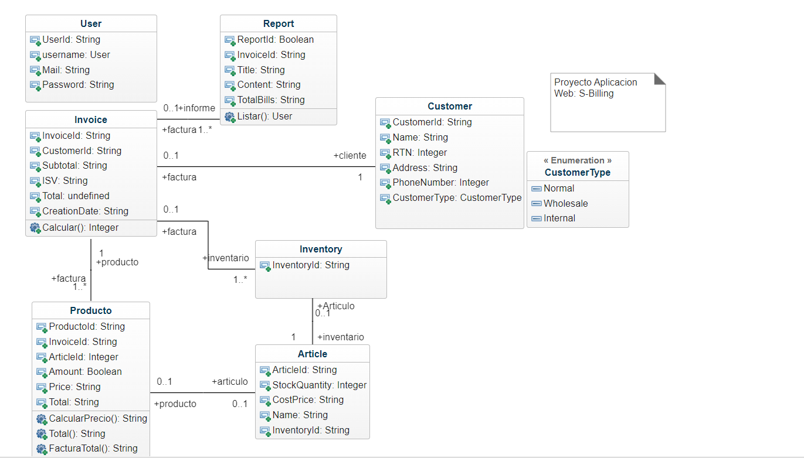

# Facturacion Net

Facturation REST API project built using C#, Microsoft Entity Framework .NET 7, Docker, Azure, Insomnia, SQL and Swagger for documentation.

## References

Facturation UML class diagram:



Informe- Avance del proyecto:

https://drive.google.com/file/d/1H8CJv2baomM6H8ESqhZRsnhKhtySuRLQ/view?usp=drive_link

## Prerequisites

- SDK .Net 7 Installed

## Getting started

To start project follow these steps:

1- Clone Github Project:

```
git clone https://github.com/jorgeabrahan/facturacion_net.git
```

2- Navigate to project folder:

```
cd facturacion_net
```

3- Compose docker running:

```
docker compose up --build
```

Run:

```
dotnet watch
```
4- From swagger you need to connect to the database 
´´´
- clone the frontend and follow the steps in the S-billing readme: https://github.com/KarenGi2002/S-Billing.git
5-

Or you can also run `dotnet watch` if you want to keep watching for changes.
